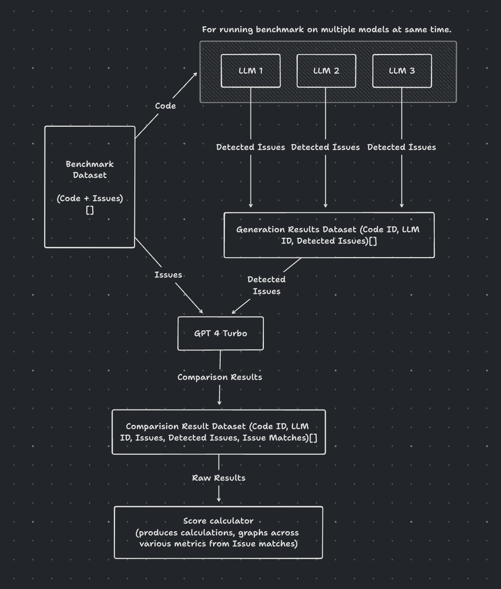

# 📊 IQ Code Benchmarks
This repository contains the code used to benchmark the IQ code LLM models.

# 📝 Table of Contents
- [🏃 Running the benchmarks](#running-the-benchmarks)
- [📈 Benchmark Goals](#benchmark-goals)
- [📂 Benchmark dataset structure](#benchmark-dataset-structure)
- [📥 Collection Process](#collection-process)
- [📋 Evaluation process](#evaluation-process)

## Running the benchmarks
1. Install the dependencies
```bash
pip install -r requirements.txt
```
2. Run the benchmarks
```bash
python src/main.py
```


## Benchmark Goals
1. It should allow us to generate deterministic metrics for LLM performance on issue detection.
Such as 
    - Overall score
    - scores against different issue categories
    - scores categorized into size of input contract
    - scores categorized into issue impacts
2. Should be cost effective and fast 

Nice to haves - 
- It should allow us to run benchmark on different LLMs in parallel

## Benchmark dataset structure
It should contain:
1. Smart contract code - This can be flattened smart contract code
2. Smart contract issues - Each issue needs -
    1. Location of issue
    2. Issue type (We need to maintain a list of all smart contract issue categories)
    3. Impact of the issue

In a file format (We can store in Parquet)

## Collection Process
We collect these types of smart contracts

1. Toy Problems: We collect toy smart contracts which are specifically designed to let students to learn about different solidity vulnerabilities. these should be easy to gather and also since these contracts often focus on one vulnerability at a time, we can evaluate LLMs for awareness of these vulnerabilities and rank them quite easily. we can collect these from https://solidity-by-example.org/hacks

2. Real Contracts: We collect real smart contracts with vulnerabilities from wild which can either have more than a single vulnerability and are logic intensive. these we can collect around 10 to start with and keep increasing as we discover more interesting contracts with hidden bugs that is not trivial to catch by static analyzers, we can collect these from code4rena audits

## Evaluation process
1. We first generate the LLM responses on smart contract code and gather them into its own
dataset
2. We then compare the LLM responses with the issues list from our benchmark dataset with
GPT 4 Turbo (since GPT 4 allows large context size we can do the comparison in batches to
avoid rate limits)
3. We parse the output from GPT 4 and store the scores based on various metrics


